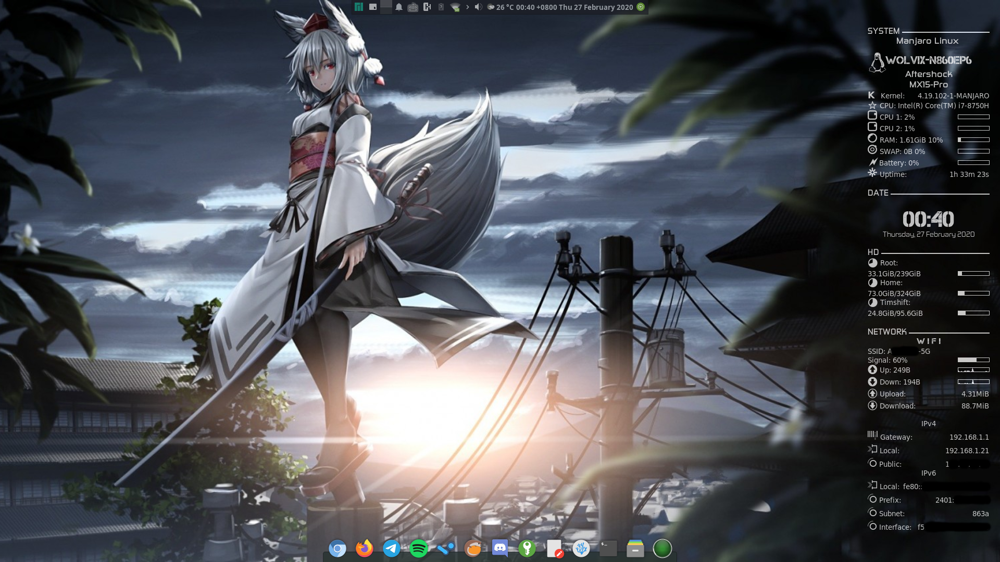

# Crunchbang Conky - Wolf Edition
A modified conky config, based on [Crunchbang Conky - simple edition by willydleonm](https://www.deviantart.com/willydleonm/art/Crunchbang-conky-simple-edition-710325640).

## Modifications:
- Added CPU model
- Modified storage display to show used space
- Added gateway, local IP, and public IP for both IPv4 and IPv6

## Installation Instructions:
- Download release file or clone repo `git clone https://github.com/lzkbloodmage/crunchbang-conky-wolf.git`.
- Extract/copy `crunchbang_wolf` folder to `/home/$USER/.conky/`
- Install all the fonts in the `fonts` folder
- Read the `UserChanges.txt` file and make any necessary changes accordingly based on your system hardware/OS 
- Apply this conky by selecting it in conky manager

## Credits
Original Crunchbang Conky: [Crunchbang Conky - quickdraw version](https://www.deviantart.com/quickdraw/art/crunchbang-conky-140611369)

Modified Crunchbang Conky: [Crunchbang Conky - simple edition](https://www.deviantart.com/willydleonm/art/Crunchbang-conky-simple-edition-710325640)

Wallpaper shown in screenshot: [Inubashiri Momiji by Jeko98](https://wallhere.com/en/wallpaper/1383733)
